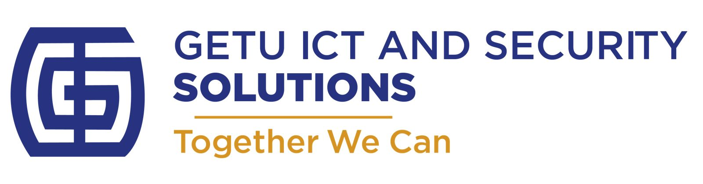

# Getu ICT and Security Solutions

<p align="center">
  
</p>

<p align="center">
  <strong>TOGETHER · WE · CAN</strong>
</p>

<p align="center">
  <a href="#about">About</a> •
  <a href="#services">Services</a> •
  <a href="#features">Features</a> •
  <a href="#tech-stack">Tech Stack</a> •
  <a href="#project-structure">Project Structure</a> •
  <a href="#getting-started">Getting Started</a> •
  <a href="#team">Team</a> •
  <a href="#contact">Contact</a> •
  <a href="#license">License</a>
</p>

---

## About

**Getu ICT and Security Solutions** is a private company owned by a team of Information Technology Specialists, founded and officially established in **Tanzania in 2017**. We specialize in providing comprehensive ICT solutions and security services to businesses, governments, NGOs, and educational institutions.

Our company is a provider of Information Technology and Telecommunications systems, specializing in high-performance and high-availability solutions. Our consultants have varying specialties through advanced training programs from our several principals covering design, deployment, and operations management.

### Our Mission
We are dedicated to helping companies build reliable and cost-effective technology models that meet their present and future technology needs.

### Our Vision
To be the leading ICT and security solutions provider in Tanzania and the East African region, enhancing and adding additional benefits to local and regional companies through innovative technology solutions.

---

## Services

We offer a wide range of ICT and security services:

### 🖥️ ICT Solutions
- **Network Installation & Administration** - Design, implementation, and management of WAN/VPN, LAN, structured cabling, VLANs, and wireless networks
- **Website Development & Hosting** - Fast, high-quality websites with 99.99% uptime hosting
- **Computer Hardware & Software Solutions** - Supply of laptops, desktops, peripherals, and licensed software
- **System Service & Troubleshooting** - Preventive maintenance and technical support
- **Intranet Development & Implementation** - Custom intranet solutions for businesses
- **Mobile Devices Supply** - Phone accessories and mobile device solutions

### 🔒 Security Solutions
- **CCTV Camera Installation** - Professional surveillance system setup
- **Electric Fence Installation** - Perimeter security solutions
- **Network Security** - Security assessment, design, and implementation using top vendors (Symantec, Cisco, McAfee)
- **ICT Security Assessments** - Vulnerability detection and analysis

### 📞 Communication Solutions
- **Enterprise VoIP** - Voice over IP solutions using ATA, dedicated phones, or softphones
- **Phone Wiring & Installation** - Professional telecommunications setup
- **Domain Name Registration** - Private registration, domain locking, transfers, and DNS management

### 🛠️ Consulting & Support
- **ICT Consultancy** - Expert guidance for technology adoption
- **Systems Analysis** - Comprehensive system evaluation
- **Network Optimization** - Maximize resources, improve quality, increase availability, and reduce costs
- **24/7 Network Monitoring** - Advanced tools to detect issues and ensure optimal performance

---

## Features

The website includes the following sections:

- **🏠 Home** - Hero section with company tagline and video introduction
- **📋 About** - Company information, history, and expertise
- **⚙️ Services** - Detailed service offerings with modals for more information
- **📊 Stats** - Real-time counters showing company achievements
- **🏢 Clients** - Showcase of trusted clients
- **❓ Why Us** - Tabbed content highlighting commitment, services, solutions, and ICT expertise
- **📦 Products** - Portfolio gallery with filtering (Phone Accessories, Internet, Computer Accessories, More)
- **👥 Team** - Team member profiles with social links
- **❓ FAQ** - Frequently asked questions section
- **📧 Contact** - Contact form, address, phone, and email information
- **📰 Newsletter** - Email subscription functionality

---

## Tech Stack

| Technology | Description |
|------------|-------------|
|  | Markup language |
|  | Styling |
|  | Client-side scripting |
|  | CSS framework |
|  | Server-side forms |
|  | CSS preprocessor |

### Libraries & Plugins

- **AOS** - Animate On Scroll library
- **GLightbox** - Lightbox library for images and videos
- **Swiper** - Modern mobile touch slider
- **PureCounter** - Animated number counter
- **Isotope** - Filtering and sorting layouts
- **Bootstrap Icons** - Icon library

---

## Project Structure

```
getu-ict/
├── assets/
│   ├── css/
│   │   └── main.css          # Main stylesheet
│   ├── img/
│   │   ├── clients/          # Client logos
│   │   ├── portfolio/        # Product images
│   │   │   └── loop/         # Products page images
│   │   ├── team/             # Team member photos
│   │   ├── hero-bg.jpg       # Hero background
│   │   ├── logo.png          # Company logo
│   │   └── ...               # Other images
│   ├── js/
│   │   └── main.js           # Main JavaScript file
│   ├── scss/                 # SCSS source files
│   └── vendor/               # Third-party libraries
│       ├── aos/
│       ├── bootstrap/
│       ├── bootstrap-icons/
│       ├── glightbox/
│       ├── imagesloaded/
│       ├── isotope-layout/
│       ├── php-email-form/
│       ├── purecounter/
│       └── swiper/
├── forms/
│   ├── contact.php           # Contact form handler
│   └── newsletter.php        # Newsletter subscription handler
├── index.html                # Main homepage
├── products-page.html        # Extended products gallery
├── portfolio-details.html    # Portfolio details template
├── service-details.html      # Service details template
├── COMPANY PROFILE.pdf       # Company profile document
├── LICENSE                   # MIT License
└── README.md                 # This file
```

---

## Getting Started

### Prerequisites

- A web server (Apache, Nginx, or any static file server)
- PHP 7.4+ (for form handling)
- A modern web browser

### Local Development

1. **Clone the repository**
   ```bash
   git clone https://github.com/gcl140/getu-ict.git
   cd getu-ict
   ```

2. **Start a local server**
   
   Using Python:
   ```bash
   # Python 3
   python -m http.server 8000
   
   # Python 2
   python -m SimpleHTTPServer 8000
   ```
   
   Using PHP:
   ```bash
   php -S localhost:8000
   ```
   
   Using Node.js (with http-server):
   ```bash
   npx http-server
   ```

3. **Open in browser**
   ```
   http://localhost:8000
   ```

### Deployment

The website can be deployed to any static web hosting service:

- **GitHub Pages** - Enable in repository settings
- **Netlify** - Connect repository for automatic deployments
- **Vercel** - Import project for instant deployment
- **Traditional Hosting** - Upload files via FTP/SFTP

> **Note:** For full form functionality (contact and newsletter), deploy to a PHP-enabled server.

---

## Team

Our experienced team of ICT professionals:

| Name | Position | Experience |
|------|----------|------------|
| Geofrey John Mushy | Managing Director | 13 years |
| Tusa M Mwakalobo | General Manager | 13 years |
| Salehe Hassan | Finance and Administration Officer | 10 years |
| John Mgonja | Network Engineer | 11 years |
| Ramso Issa | Network Associate | 8 years |
| Gift Gift | Security Administrator / Web Developer | 7 years |
| Mbwana Hassan | Analyst Programmer | 3 years |
| Theresia Dedu | Web Developer | 5 years |
| Nitike John | Office Assistant | 11 years |
| Kissah Emily | Supervisor | 5 years |

---

## Contact

**Getu ICT and Security Solutions**

📍 **Address:**  
Mazengo/Kiwanuka Upanga  
Dar-es-Salaam, Tanzania  
P.O. Box 1727, Plot 724/00

📞 **Phone:**  
- +255 755 097 676  
- +255 714 113 015

📧 **Email:**  
getuictandsecuritysolution@gmail.com

🌐 **Social Media:**  
[](https://www.instagram.com/ictandsecuritysolutions)

---

## Statistics

- 🎉 **232+** Happy Clients
- 📁 **521+** Projects Completed
- ⏱️ **1,463+** Hours of Support
- 👷 **10** Hard Workers

---

## License

This project is licensed under the MIT License - see the [LICENSE](LICENSE) file for details.

```
MIT License

Copyright (c) 2025 Gift Christian

Permission is hereby granted, free of charge, to any person obtaining a copy
of this software and associated documentation files (the "Software"), to deal
in the Software without restriction, including without limitation the rights
to use, copy, modify, merge, publish, distribute, sublicense, and/or sell
copies of the Software, and to permit persons to whom the Software is
furnished to do so, subject to the following conditions:

The above copyright notice and this permission notice shall be included in all
copies or substantial portions of the Software.
```

---

## Acknowledgments

- Website template based on [Dewi Bootstrap Template](https://bootstrapmade.com/dewi-free-multi-purpose-html-template/) by BootstrapMade
- Icons by [Bootstrap Icons](https://icons.getbootstrap.com/)
- Fonts by [Google Fonts](https://fonts.google.com/)

---

<p align="center">
  Made with ❤️ by <a href="tel:+255758523353">GCL</a>
</p>

<p align="center">
  © 2025 Getu ICT and Security Solutions. All Rights Reserved.
</p>
